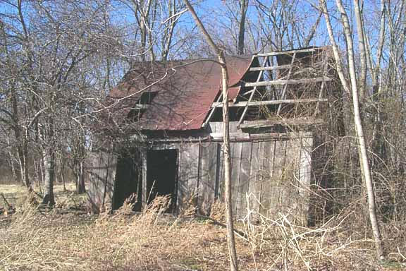

ToolShed v1.0
-------------

## A Color Computer Cross-Development Toolset

<http://www.sourceforge.net/projects/toolshed>

---

* [Introduction](#introduction)
* [A Tutorial On Disk Images](#tutorial)
* [rma, rlink and rdump](#rma)
* [os9](#os9) - Manipulate OS-9 formatted disk images
  * [ATTR](#attr_os9) - Display or modify file attributes
  * [CMP](#cmp) - Compare the contents of two files
  * [COPY](#copy_os9) - Copy one or more files to a target directory
  * [DCHECK](#dcheck) - Verify the file structure of an RBF disk image
  * [DEL](#del) - Delete one or more files
  * [DELDIR](#deldir) - Delete a directory and its contents
  * [DIR](#dir_os9) - Display the contents of a directory
  * [DSAVE](#dsave_os9) - Copy the contents of a directory or device
  * [DUMP](#dump_os9) - Display the contents of a binary file
  * [FORMAT](#format) - Create a disk image of a given size and type
  * [FREE](#free_os9) - Display the amount of free space on an image
  * [FSTAT](#fstat_os9) - Display the file descriptor sector for a file
  * [GEN](#gen) - Prepare a disk image for booting
  * [ID](#id) - Display sector 0 of an image
  * [IDENT](#ident) - Display OS-9 module information
  * [LIST](#list_os9) - Display contents of a text file
  * [MAKDIR](#makdir) - Create one or more directories
  * [MODBUST](#modbust) - Bust a single merged file of OS-9 modules into separate files
  * [PADROM](#padrom) - Pad a file to a specific length
  * [RENAME](#rename_os9) - Give a file a new filename
* [decb](#decb) - Manipulate RSDOS formatted disk images
  * [ATTR](#attr_decb) - Display or modify file attributes
  * [COPY](#copy_decb) - Copy one or more files to a target directory
  * [DIR](#dir_decb) - Display the directory of a Disk BASIC image
  * [DSAVE](#dsave_decb) - Copy the contents of a directory or device
  * [DSKINI](#dskini) - Create a Disk BASIC image of a given size
  * [DUMP](#dump_decb) - Display the contents of a binary file
  * [FREE](#free_decb) - Display the number of free granules
  * [FSTAT](#fstat_decb) - Display the file descriptor sector for a file
  * [HDBCONV](#hdbconv) - Converts an HDB-DOS disk image into a 512-byte sector compatible one
  * [KILL](#kill) - Remove files from a Disk BASIC image
  * [LIST](#list_decb) - Display the contents of a file
  * [RENAME](#rename_decb) - Give a file a new filename
* [ar2](#ar2)

---

<h2 id="introduction">Introduction</h2>

Some of the ToolShed Team: Tormod Volden, Tim Lindner, James Jones, Mark Marlette, Boisy Pitre, Roy Justus

Say hello to ToolShed, a free software product which houses a set of utilities designed  to help you create programs and applications for several computing platforms for the Color Computer and Dragon systems running BASIC or NitrOS-9.

ToolShed brings you the ease and speed of developing these programs to your modern personal computer running Windows, Mac OS X or Linux. The tools in the shed consist of a relocatable macro assembler/linker and intermediate code analyzer, a stand-alone assembler, an OS-9/Disk BASIC file manager and more.

If you have performed assembly language programming on the CoCo before, you're probably familiar with either EDTASM under Disk BASIC, or the asm, rma and rlink tools under OS-9. ToolShed brings you similar tools that allow you to assemble 6809 and 6309 code efficiently.

### A Little Bit Of History

ToolShed started out life in the mid-to-late 1990s as a 6809 cross-assembler under Linux developed by Alan DeKok and Boisy Pitre. Specifically designed for assembling the source base to NitrOS-9, the assembler was expanded to include support for the 6309. Later, additional tools to read disk images from OS-9 and Disk BASIC images were created and added to the shed. Now, the tool shed has now been expanded to include a number of useful software tools that can assist greatly in the software development process.

### os9 & decb

The main task of the os9 and decb tools is to allow the manipulation, inspection and copying of files from disk images to your PC's file system, and vice versa. The os9 tool recognizes disk images that contain data in the RBF file format created under OS-9 or NitrOS-9, while the decb tool recognizes disk images formatted under Disk BASIC for the Color Computer.

### rma & rlink

Managing a sizable assembly language source file for a complex program can be daunting. It is easy to become confused and lost in lines and lines of source code. rma (relocatable macro assembler) and rlink (relocatable linker) are two tools that are well suited for handling programs large and small, and work together to create both Disk BASIC and NitrOS-9 object files.

The relocatable macro assembler and linker give you the ability to write complex assembly language programs in different source files, then link them together to form a single OS-9 or Disk BASIC object file that can be loaded and executed.

### rdump

The output of the rma macro assembler is a ROF (relocatable object file). rdump allows the inspection of this intermediate file, and can also act as a disassembler.

### mamou

If you are comfortable with using the asm assembler that was part of OS-9/6809, then you will feel at home with mamou. This tool is more suited for assembly language programs that contain their entire source code in one file.

### ar2

Carl Kreider is a long time OS-9/6809 user and programmer, and has graciously given us permission to include his archiver utility, ar2, in ToolShed.

---
<h2 id="tutorial">A Tutorial On Disk Images</h2>

One of the most frequent questions that come up in dealing with Color Computer disks is "How do I move the data from my old disks over to my PC?"  When discussing the moving of files between a NitrOS-9 or Disk BASIC disk, the physical disk media is of no concern to ToolShed -- in fact, this software does not even know how to extract information from a physical diskette. What ToolShed does understand is the logical underpinnings of the RBF and Disk BASIC file systems, and how to properly manipulate files at that level.

The fact that ToolShed is agnostic to physical media begs the question: how does one transfer the contents of a physical disk to a location where ToolShed can work on the image, and vice versa?  The answer is dependent upon the host computer. For Windows systems, utilities exist to extract image data from physical floppy disks and onto a hard drive for use. For Linux and Mac OS X, there are varying approaches, depending on your media, for obtaining an image from a physical diskette.

### Disk Extraction Under Windows/DOS

For the example below, we will assume that the 3.5" 720K floppy drive is `A:`, and the 5.25" 360K floppy drive is `B:`

The tool required to transfer DSK images to floppies under DOS/Windows is `DSKINI.EXE`.

Once `DSKINI.EXE` has been downloaded and extracted, call up a Command Prompt window under Windows (if you're not using MS-DOS), and insert a blank 5.25" 360K diskette into drive B. Presuming the image being transfered is `nos96309l2v030200_ds40_1.dsk`, type:

    DSKINI /T40 /D B: NOS963~1.DSK

Note the use of the mangled filename form here. If you are running Windows, you can type the full length filename

Once the transfer completes, you should have an exact image of the disk on the floppy, and can now use that floppy on a real CoCo.

### Disk Extraction Under Linux

For Linux users, you will need to download the fdutils package at http://fdutils.linux.lu/. Once installed, insert a blank floppy into your 5.25" 360K or 3.5" 1.44MB/720K drive. It will be either /dev/fd0 or /dev/fd1 depending on its position in the drive chain. For this example, we will assume /dev/fd1.

You must tell Linux the type of disk in the drive. You must do this EVERY TIME you insert a disk into the floppy drive, as Linux "forgets" the disk type when you take the disk out:

    setfdprm /dev/fd1 coco40ds

Now you can format the disk:

    fdformat /dev/fd1

Once the format is complete, transfer the image as follows:

    dd if=nos96309l2v030200_ds40_1.dsk of=/dev/fd1

Once the command is complete, the disk will contain the image and can be used in a CoCo disk drive system.

### Pathname Elements

Since ToolShed runs on various platforms, then there must be a method to differentiate between host file system pathnames and OS-9/Disk BASIC pathnames within the image itself. This is achieved by mandating the use of the , (comma) character as a delineator between the host path and the OS-9/Disk BASIC path (the path within the disk image). To better understand this, let's take a look at a few examples.

On our theoretical host computer, a file exists that you wished to have copied to an OS-9 disk image. The file to copy, test1, resides on the host file system in the same directory as the disk image file, os9.dsk. To copy test1 to the disk image, you would type:

    os9 copy test1 os9.dsk,

Notice the use of the comma at the end of the second parameter. This tells the os9 program that you wish to copy the file test1 over to the root directory of the os9.dsk image.

What happened if you didn't put the comma at the end of the second parameter?  os9 copy would have copied test1 on top of the os9.dsk image, effectively replacing your entire disk image with the contents of test1. This is probably not the intended effect.

Let's take the example a step further. A file exists in the os9.dsk image file, in RBF format, that you wish to copy to your host file system, in the root directory. The file on the disk image is named test2, and resides in the RBF subdirectory path DIR1/DIR2. How would you copy the file to your host file system's root?

For Mac OS X or Linux:

    os9 copy os9.dsk,DIR1/DIR2/test2 /

For Windows/DOS:

    os9 copy os9.dsk,DIR1/DIR2/test2 C:\

Once again, the comma is used to differentiate the local file system from the RBF file system that exists in the disk image file.

You can even copy files between disk images. Assume you had a disk image named nuther.dsk and wanted to copy the above file to the root directory of that disk image.

    os9 copy os9.dsk,DIR1/DIR2/test2 nuther.dsk,

Note the comma is present in both arguments, indicating that both pathlists point to a file within an RBF disk image. In fact, every command in the ToolShed package recognizes this distinct meaning and use of the comma.

This intelligence allows ToolShed to act differently depending upon whether it is acting on the file on a disk image or host file system. The result is that most commands built into ToolShed also work on the host file system too.

An example of this:

    os9 dir os9.dsk, -e

will display the extended root directory on the specified disk image. Similarly:

    os9 dir . -e

will display the extended directory on the current directory of the host file system (the -e option behaves similar to ls -l on Unix-based systems).

---

<h2 id="rma">rma, rlink and rdump</h2>

If you have used the software tools from the OS-9 Development System sold by Radio Shack for the Color Computer, then you will be right at home with rma, rlink and rdump. These tools behave exactly the same and have identical function to their Color Computer counterparts.

### Roles and Responsibilities

The function of each of these tools can be summed as follows: rma assembles source code into intermediate object code files called ROFs, and rlink assembles one or more ROFs into a binary executable file.

Let's look at a hypothetical program called doesitall. This program is a whiz-bang text processor written in 6809 assembly language and is composed of three files: main.a, sub.a and io.a. On top of that, the program uses routines from the alib assembly routine library (available from the NitrOS-9 Project). Here's how you would assemble a working executable from these files:

    rma main.a -o=main.r
    rma sub.a -o=sub.r
    rma io.a -o=io.r
    rlink main.r sub.r io.r -l=alib.l

---

<h2 id="os9">os9</h2>
The following pages document the commands built into the os9 tool. As the examples above illustrated, the built in commands such as dir, copy, etc. must be executed from the os9 executive, and any parameters for that command follow the command name.

Issuing the os9 command without any parameters will provide a list of available subcommands. Issuing a subcommand without any parameters will display help on using the subcommand.

While many commands will work fine host file systems, some commands are designed to only be run on an RBF disk image or file within that image. The Scope section makes it clear in what context the command should be run.

---

<h3 id="attr_os9">ATTR - Display or modify file attributes</h3>

#### Syntax and Scope

    attr {[<opts>]} {<file> [<...>]} {[<opts>]}

This command is intended for RBF disk image files only.

#### Options
<table>
<tr><td>-q</td><td>quiet mode (suppress output)</td></tr>
<tr><td>-e</td><td>set execute permission</td></tr>
<tr><td>-w</td><td>set write permission</td></tr>
<tr><td>-r</td><td>set read permission</td></tr>
<tr><td>-s</td><td>set single user bit</td></tr>
<tr><td>-p[ewr]</td><td>set public execute, write or read permission</td></tr>
<tr><td>-n[ewr]</td><td>unset execute, write or read permission</td></tr>
<tr><td>-np[ewr]</td><td>unset public execute, public write or public read permission</td></tr>
</table>
#### Description

Every file in the RBF file system possesses attributes. These attributes determine how a file can be accessed: whether it can be executed, written or read to by its owner or others, whether it is a directory, and whether or not it can be opened more than once at a time.

The attr command allows you to display the attributes of a file or modify these attributes by specifying the above options. If the attribute for a given file is set, then it appears in its proper position. If the attribute is not set, a dash (-) character appears in its place.

#### Examples

Displaying a file's attributes:

    os9 attr os9l2.dsk,startup
    ----r-wr

Turn off a file's public read attribute:

    os9 attr os9l2.dsk,startup -npr
    ------wr

---

<h3 id="cmp">CMP - Compare the contents of two files</h3>

####Syntax and Scope

    cmp {[<opts>]} <file1> <file2> {[<...>]} {[<opts>]}

This command will work on Disk BASIC and RBF disk image files as well as host files.

#### Description

cmp compares the contents of two files, on a byte-by-byte basis, and displays a summary of the differences, as well as an indication of which file was longer. cmp is not suitable for line by line comparisons, only byte comparisons.

#### Examples

Comparing two files of the same size and content:

    os9 cmp file1 file2

    Differences
    None
    Bytes compared:   00027600
    Bytes different:  00000000

Comparing two files of different size and content:

    os9 cmp image1,shortfile image2,longfile
    Differences
    byte      #1 #2
    ========  == ==
    00000001  6f 61
    0000000c  69 61
    00000013  0a 20
    Bytes compared:   00000014
    Bytes different:  00000003
    image2,longfile is longer

---

<h3 id="copy_os9">COPY - Copy one or more files to a target directory</h3>

#### Syntax and Scope

    copy {[<opts>]} <srcfile> {[<...>]} <target> {[<opts>]}

This command will work on Disk BASIC and RBF disk image files as well as host files.

#### Options
<table>
<tr><td>-b=size</td><td>size of copy buffer in bytes or K-bytes</td></tr>
<tr><td>-l</td><td>perform end of line translation</td></tr>
<tr><td>-o=id</td><td>set file's owner as id</td></tr>
<tr><td>-r</td><td>rewrite if file exists</td></tr>
</table>

#### Description

The copy command will create an exact copy of a file on either an RBF disk image or on the host file system. If a file already exists on the destination disk image or file system, an error will be returned. If you want to force the copy, use the -r option.

The -l option performs end of line translation when copying between the host file system and the RBF disk image. You should only use the -l option on text files, not binary files. When copying files to a disk image, the user id of the user on the host system is set in the file's ID sector. If you want to override this, you can use the -o option, specifying the ID of the file's owner as it resides on the RBF disk image.

#### Examples

Copying a file from an RBF disk image to the host:

    os9 copy os9l2.dsk,cmds/procs procs
    Copying a file from the host to an RBF disk image:
    os9 copy binary_file os9l2.dsk,binfile
    Copying a text file from the host to an RBF disk image:
    os9 copy -l text_file os9l2.dsk,txtfile

---

<h3 id="dcheck">DCHECK - Verify the file structure of an RBF disk image</h3>

#### Syntax and Scope

    dcheck {[<opts>]} {<disk> [<...>]} {[<opts>]}

This command is intended for RBF disk images only.

#### Options
<table>
<tr><td>-s</td><td>check the number of directories and files and display the results.</td></tr>
<tr><td>-b</td><td>suppress listing of unused clusters</td></tr>
<tr><td>-p</td><td>print pathlists of questionable clusters</td></tr>
</table>

#### Description

The dcheck command verifies the integrity of an RBF disk image's structure by running a series of internal tests to determine the veracity of the bitmap to the actual state of the file system.

#### Examples

Using dcheck to verify an RBF disk image:

    os9 dcheck l2tools.dsk
    Volume - 'Level II Tools' in file: l2tools
    $004F bytes in allocation map
    1 sector per cluster
    $000276 total sectors on media
    Sector $000002 is start of root directory file descriptor
    Building secondary allocation map...
    Comparing primary and secondary allocation maps...
    0 previously allocated cluster found
    0 clusters in file structure but not in allocation map
    0 clusters in allocation map but not in file structure
    0 bad file decriptor sector
    'Level II Tools' file structure is intact
    2 directories
    28 files

---

<h3 id="del">DEL - Delete one or more files</h3>

#### Syntax and Scope

    del {[<opts>]} {<file> [<...>]} {[<opts>]}

This command is intended for RBF disk images only.

#### Description

del will delete a file from the disk. It does not delete directories (see deldir if you want to delete directories).

#### Examples

Deleting a file on an RBF disk image:

    os9 del os9l2.dsk,sys/stdfonts

---

<h3 id="deldir">DELDIR - Delete a directory and its contents</h3>

#### Syntax and Scope

    deldir {[<opts>]} {<directory>} {[<opts>]}

This command is intended for RBF disk image files only.

#### Options

<table>
<tr><td>-q</td><td>quiet mode (suppress interaction)</td></tr>
</table>

#### Description

deldir will delete a directory from the disk. If the -q option is specified, it will quietly delete any files and subdirectories; otherwise, it will prompt you upon entering each directory that it finds.

#### Examples

Deleting a directory on an RBF disk image:

    os9 deldir os9l2.dsk,sys
    Deleting directory: os9l2.dsk,sys
    List directory, delete directory, or quit? (l/d/q) d

---

<h3 id="dir_os9">DIR - Display the contents of a directory</h3>

#### Syntax and Scope

    dir {[<opts>]} {<dir> [<...>]} {[<opts>]}

This command is intended for RBF disk images only.

#### Options

<table>
<tr><td>-a</td><td>show all files</td></tr>
<tr><td>-e</td><td>extended directory</td></tr>
<tr><td>-r</td><td>recurse directories</td></tr>
</table>

#### Description

The dir command displays the contents of directories on an RBF disk image or the host file system.

#### Examples

Displaying an extended directory on an RBF disk image:

    os9 dir -e l2tools,
                               Directory of l2tools,.
     Owner    Last modified    Attributes Sector Bytecount Name
    -------   ---------------  ---------- ------ --------- ----
      0.0     1988/06/02 2133   d-ewrewr       B       864 CMDS
      0.0     1988/06/02 2339   -----ewr     115      2003 Install1
      0.0     1988/06/02 2338   ------wr      E2      1315 Install2
      0.0     1988/06/02 2338   ------wr     10F      1316 InstallH

---

<h3 id="dsave_os9">DSAVE - Copy the contents of a directory or device</h3>

#### Syntax and Scope

    dsave {[<opts>]} {[<source>]} <target> {[<opts>]}

This command will work on Disk BASIC and RBF disk image files as well as host files.

#### Options
<table>
<tr><td>-b=size</td><td>size of copy buffer in bytes or K-bytes</td></tr>
<tr><td>-e</td><td>actually execute commands</td></tr>
<tr><td>-l</td><td>perform end of line translation on copy</td></tr>
<tr><td>-r</td><td>force rewrite on copy</td></tr>
</table>

#### Description

The dsave command recursively copies files from a directory to another device.

---

<h3 id="dump_os9">DUMP - Display the contents of a binary file</h3>

#### Syntax and Scope

    dump {[<opts>]} {<file> [<...>]} {[<opts>]}

This command will work on Disk BASIC and RBF disk image files as well as host files.

#### Options
<table>
<tr><td>-a</td><td>dump output in assembler format (hex)</td></tr>
<tr><td>-b</td><td>dump output in assembler format (binary)</td></tr>
<tr><td>-c</td><td>don't display ASCII character data</td></tr>
<tr><td>-h</td><td>don't display header</td></tr>
<tr><td>-l</td><td>don't display line label/count</td></tr>
</table>
#### Description

The dump command allows you to see the contents of any file, including binary files. It does this by displaying the data in hexadecimal format and providing cues such as offset labels and headers so that it is easy to reference the location of a specific byte. By default, the output of a typical dump will look like this:

      Addr     0 1  2 3  4 5  6 7  8 9  A B  C D  E F 0 2 4 6 8 A C E
    --------  ---- ---- ---- ---- ---- ---- ---- ---- ----------------
    00000000  0002 7612 004f 0001 0000 0200 00ff 5e12 ..v..O........^.
    00000010  0200 1200 0000 0000 0000 5805 0513 004c ..........X....L
    00000020  6576 656c 2049 4920 546f 6f6c f300 0000 evel II Tools...
    00000030  0000 0000 0000 0000 0000 0000 0000 0001 ................
    00000040  0003 2001 0028 0200 0012 0012 0308 0058 .. ..(.........X
    00000050  0000 0000 0000 0000 0000 0000 0079 3600 .............y6.
    00000060  0000 0000 0000 0000 0000 0000 0000 0000 ................
    00000070  0000 0000 0000 0000 0000 0000 0000 0000 ................
    00000080  0000 0000 0000 0000 0000 0000 0000 0000 ................
    00000090  0000 0000 0000 0000 0000 0000 0000 0000 ................
    000000a0  0000 0000 0000 0000 0000 0000 0000 0000 ................
    000000b0  0000 0000 0000 0000 0000 0000 0000 0000 ................
    000000c0  0000 0000 0000 0000 0000 0000 0000 0000 ................
    000000d0  0000 0000 0000 0000 0000 0000 0000 0000 ................
    000000e0  0000 0000 0000 0000 0000 0000 0000 0000 ................
    000000f0  0000 0000 0000 0000 0000 0000 0000 0000 ................

Note that the address of the offset on the left column increases by 16 ($10) bytes each line, and the header above shows the position of the byte into that 16 byte line. An additional piece of information provided is the ASCII character table on the right that shows the ASCII representation of the characters on that line.

Additional command line options are provided to omit certain parts of the dump output, including the header and ASCII data. Also, the -a and -b options are provided to allow dumping of a file's contents into a format digestible by certain assemblers.

---

<h3 id="format">FORMAT - Create a disk image of a given size and type</h3>

#### Syntax and Scope

    format {[<opts>]} <disk> {[<...>]} {[<opts>]}

This command is intended to work on the host file system only.

#### Options
<table>
<tr><td>-bsX</td><td>bytes per sector (default = 256)</td></tr>
<tr><td>-cX</td><td>cluster size</td></tr>
<tr><td>-e</td><td>format entire disk (make full sized image)</td></tr>
<tr><td>-k</td><td>make OS-9/68K LSN0</td></tr>
<tr><td>-nX</td><td>disk name</td></tr>
<tr><td>-q</td><td>quiet; do not report format summary</td></tr>
</table>

#### Floppy Options
<table>
<tr><td>-4</td><td>48 tpi (default)</td></tr>
<tr><td>-9</td><td>96 tpi</td></tr>
<tr><td>-sa</td><td>sector allocation size (SAS)</td></tr>
<tr><td>-sd</td><td>single density</td></tr>
<tr><td>-dd</td><td>double density (default)</td></tr>
<tr><td>-ss</td><td>single sided (default)</td></tr>
<tr><td>-ds</td><td>double sided</td></tr>
<tr><td>-tX</td><td>tracks (default = 35)</td></tr>
<tr><td>-stX</td><td>sectors per track (default = 18)</td></tr>
<tr><td>-dr</td><td>format a Dragon disk</td></tr>
</table>

#### Hard Drive Options
<table>
<tr><td>-lX</td><td>number of logical sectors</td></tr>
</table>

#### Description

The format command creates a file on the host file system which itself is an empty RBF disk image. This image ca then be used to hold files and directories.

Besides the normal options, there are two other groups of options: floppy options and hard drive options. Each set of options are mutually exclusive, and aren't meant to be mixed together.

Floppy options allow an RBF image to be created with certain flags set in LSN0 which identify the physical aspect of the disk (single vs. double density, single or double sided, 48 or 96 tracks per inch, etc.). These options do not affect how files are read or written to the image. They are important, however, if you choose to bring the disk image over to a physical floppy disk. The floppy options should be manipulated to match the physical media to which the image will be transferred.

The hard drive option, -l, lets you specify the size of the RBF image you wish to create in sectors. Combined with the -bs option, you can create a disk image of considerable size with this option. Note that images created with the -l option shouldn't be transferred to floppy disks. Note that in order to create a fully sized disk image, the -e option needs to be used. Otherwise, the disk image will be made only large enough to accommodate the LSN0, bitmap and root directory sectors.

#### Example

To create an empty disk image that will fit neatly onto a 35 track single-sided 5.25" floppy disk, type:

    os9 format ss35.dsk -ss -t35 -e
    For a 40 track, double-sided 5.25" floppy disk image, type:
    os9 format ds40.dsk -ds -t40 -e
    For an 80 track, double-sided 3.5" floppy disk image, type:
    os9 format ds80.dsk -ds -t80 -e -9

---

<h3 id="free_os9">FREE - Display the amount of free space on an image</h3>

#### Syntax and Scope

    free {[<opts>]} {<disk> [<...>]} {[<opts>]}

This command is intended for RBF disk image files only.

#### Description

free displays the amount of free space on an RBF image.

#### Example
    os9 free l2tools
    "Level II Tools" created on 05/05/1988
    Capacity: 157KB (630 sectors) 1-sector clusters
    352 Free sectors, largest block 344 sectors
    Free space: 88KB (90112 bytes)

---

<h3 id="fstat_os9">FSTAT - Display the file descriptor sector for a file</h3>

#### Syntax and Scope

    fstat {[<opts>]} {<file> [<...>]} {[<opts>]}

This command is intended for RBF disk image files only.

#### Description

fstat displays information about a file from the file descriptor sector.

#### Example
    os9 fstat l2tools,cmds/wend
    File Information for l2tools,cmds/wend
      Attributes         : --e-rewr
      Owner              : 0.0
      Last modified date : 02/16/1987 00:09
      Link count         : 1
      File size          : 43
      Creation date      : 02/16/1987 00:01
      Segment list:
         1. LSN1 ($10D)   1 sector

---

<h3 id="gen">GEN - Prepare a disk image for booting</h3>

#### Syntax and Scope

    gen {[<opts>]} {<disk_image>}

This command will work on RBF disk images only.

#### Options
<table>
<tr><td>-b=bootfile</td><td>bootfile to copy and link to the image</td></tr>
<tr><td>-c</td><td>CoCo disk</td></tr>
<tr><td>-d</td><td>Dragon disk</td></tr>
<tr><td>-e</td><td>Extended boot (fragmented)</td></tr>
<tr><td>-t=trackfile</td><td>kernel trackfile to copy to the image</td></tr>
</table>

#### Description

The gen command gives a disk image the ability to become a bootable disk for a CoCo or Dragon machine.

---

<h3 id="id">ID - Display sector 0 of an image</h3>

#### Syntax

    id {[<opts>]} {<disk> [<...>]} {[<opts>]}

This command is intended for RBF disk images only.

#### Description

fstat displays information about an image from the identification sector (LSN 0).

#### Examples
    os9 id l2tools
    LSN0 Information:
      Total sectors   :   630
      Track size      :   18
      Bytes in bitmap :   79
      Sectors/Cluster :   1
      Root dir sector :   2
      Disk owner      :   0.0
      Disk attributes :   dsewrewr
      Disk ID         :   $5E12
      Disk format     :   $2 (48 TPI, Double Density, Single Sided)
      Sectors/track   :   18
      Boot sector     :   0
      Bootfile size   :   0
      Creation date   :   05/05/1988 19:00
      Disk name       :   Level II Tools
      Bytes/Sector    :   256

---

<h3 id="ident">IDENT - Display OS-9 module information</h3>

#### Syntax and Scope

    ident {[<opts>]} {<file> [<...>]} {[<opts>]}

This command will work on Disk BASIC and RBF disk image files as well as host files.

#### Options
<table>
<tr><td>-s</td><td>short output</td></tr>
</table>

#### Description

The ident command displays a summary of information about one or more OS-9 modules.

#### Examples
    os9 ident l2tools,cmds/wcopy
    Header for : Wcopy
    Module size: $33C  #828
    Module CRC : $5A42B2 (Good)
    Hdr parity : $17
    Exec. off  : $00D2  #210
    Data size  : $0500  #1280
    Edition    : $43  #67
    Ty/La At/Rv: $11 $81
    Prog mod, 6809 Obj, re-ent, R/O

---

<h3 id="list_os9">LIST - Display contents of a text file</h3>

#### Syntax and Scope

    list {[<opts>]} {<file> [<...>]} {[<opts>]}

This command is intended for RBF disk image files only.

#### Description

The list command displays the contents of text files.

#### Examples
    os9 list l2tools,installh
    t
    *************************************
    *   L e v e l    I I    T o o l s   *
    *                                   *
    *  Copyright (C) 1988               *
    *  Alpha Software Technologies      *
    *  All rights reserved              *
    *                                   *
    *  Installation now in progress... *
    *************************************
    -t

---

<h3 id="makdir">MAKDIR - Create one or more directories</h3>

#### Syntax and Scope

    makdir {<dirname> [<...>]}

This command is intended for RBF disk images only.

#### Description

The makdir command creates directories.

---

<h3 id="modbust">MODBUST - Bust a single merged file of OS-9 modules into separate files</h3>

#### Syntax and Scope

    modbust {[<opts>]} {<file> [<...>]} {[<opts>]}

This command will work on Disk BASIC and RBF disk image files as well as host files.

#### Description

The modbust command will create separate files, each containing an OS-9 module, from a single file that contains one or more merged OS-9 modules. The resulting files are created on the host file system, and the names of the files reflect the name of the module.

---

<h3 id="padrom">PADROM - Pad a file to a specific length</h3>

#### Syntax and Scope

    padrom {[<opts>]} <padsize> {<file> [<...>]} {[<opts>]}

This command will work on Disk BASIC and RBF disk image files as well as host files.

#### Options
<table>
<tr><td>-b</td><td>place padding at the beginning of the file</td></tr>
<tr><td>-c[=]n</td><td>character to pad (n=dec, %bin, 0oct or $hex)</td></tr>
</table>
#### Description

The padrom command extends the size of a file to the passed size with the passed padding character.

---

<h3 id="rename_os9">RENAME - Give a file a new filename</h3>

#### Syntax and Scope

    rename {<file> <newfilename>}

This command is intended for RBF disk image files only.

#### Description

The rename command renames a file with a new filename.

---

<h2 id="decb">decb</h2>

The following pages document the commands built into the decb tool. Its interface is similar to that of the os9 tool discussed in previous pages.

Issuing the decb command without any parameters will provide a list of available subcommands. Issuing a subcommand without any parameters will display help on using the subcommand.

Use decb to copy files to and from Disk BASIC formatted disk images to your host file system. While many commands will work fine host file systems, some commands are designed to only be run on a Disk BASIC disk image or file within that image. The Scope section makes it clear in what context the command should be run.

---

<h3 id="attr_decb">ATTR - Display or modify file attributes</h3>

#### Syntax and Scope

    attr {[<opts>]} {<file> [<...>]} {[<opts>]}

This command is intended for Disk BASIC disk image files only.

#### Options
<table>
<tr><td>-0</td><td>BASIC program</td></tr>
<tr><td>-1</td><td>BASIC data file</td></tr>
<tr><td>-2</td><td>Machine-language program</td></tr>
<tr><td>-3</td><td>Text file</td></tr>
<tr><td>-a</td><td>ASCII file</td></tr>
<tr><td>-b</td><td>Binary file</td></tr>
</table>
#### Description

Every file in the Disk BASIC file system possesses attributes. These attributes determine the representation of the file's contents, as well as what application the file is intended for. The attr command allows you to modify these attributes by specifying the above

#### Examples

Change a file's attribute to a text file:

    decb attr decb.dsk,TEST.DAT -3

---

<h3 id="copy_decb">COPY - Copy one or more files to a target directory</h3>

#### Syntax and Scope

    copy {[<opts>]} <srcfile> {[<...>]} <target> {[<opts>]}

This command will work on Disk BASIC and RBF disk image files as well as host files.

#### Options
<table>
<tr><td>-[0-3]</td><td>file type (when copying to a Disk BASIC image)</td></tr>
<tr><td></td><td>0 = BASIC program</td></tr>
<tr><td></td><td>1 = BASIC data file</td></tr>
<tr><td></td><td>2 = machine-language program</td></tr>
<tr><td></td><td>3 = text editor source file</td></tr>
<tr><td>-[a|b]</td><td>data type (a = ASCII, b = binary)</td></tr>
<tr><td>-l</td><td>perform end of line translation</td></tr>
<tr><td>-r</td><td>rewrite if file exists</td></tr>
<tr><td>-t</td><td>perform BASIC token translation</td></tr>
<tr><td>-c</td><td>perform segment concatenation on machine language loadables</td></tr>
</table>
#### Description

The copy command will create an exact copy of a file on either a Disk BASIC disk image or on the host file system. The -l option performs end of line translation when copying between the host file system and the Disk BASIC disk image. You should only use the -l option on text files, not binary files. If a file already exists on the destination disk image or file system, an error will be returned. If you want to force the copy, use the -r option.

#### Examples

Copying a file from a Disk BASIC disk image to the host:

    decb copy decb.dsk,TEST.BAS TEST.BAS
    Copying a BASIC file from the host to a Disk BASIC disk image with tokenization:
    decb copy myprog.bas -t decb.dsk,MYPROG.BAS
    Copying a text file from the host to a Disk BASIC disk image:
    decb copy -l -3 -a file.txt decb.dsk,file.txt

---

<h3 id="dir_decb">DIR - Display the directory of a Disk BASIC image</h3>

#### Syntax and Scope

    dir {[<opts>]} {<dir> [<...>]} {[<opts>]}

This command is intended for Disk BASIC disk images only.

#### Description

The dir command displays the directory of a Disk BASIC disk image or the host file system.

#### Examples

Displaying an extended directory

    decb dir decb.dsk,

---

<h3 id="dsave_decb">DSAVE - Copy the contents of a directory or device</h3>

#### Syntax and Scope

    dsave {[<opts>]} {[<source>]} <target> {[<opts>]}

This command will work on Disk BASIC and RBF disk image files as well as host files.

#### Options
<table>
<tr><td>-b=size</td><td>size of copy buffer in bytes or K-bytes</td></tr>
<tr><td>-e</td><td>actually execute commands</td></tr>
<tr><td>-l</td><td>perform end of line translation on copy</td></tr>
<tr><td>-r</td><td>force rewrite on copy</td></tr>
</table>

#### Description

The dsave command recursively copies files from a directory to another device.

---

<h3 id="dskini">DSKINI - Create a Disk BASIC image of a given size</h3>

#### Syntax and Scope

    dskini {[<opts>]} <disk> {[<...>]} {[<opts>]}

This command is intended to work on the host file system only.

#### Options
<table>
<tr><td>-3</td><td>35 track disk (default)</td></tr>
<tr><td>-4</td><td>40 track disk</td></tr>
<tr><td>-8</td><td>80 track disk</td></tr>
<tr><td>-h<num></td><td>create <num> HDB-DOS drives</td></tr>
<tr><td>-n<name></td><td>HDB-DOS disk name</td></tr>
<tr><td>-s</td><td>create a "skitzo" disk</td></tr>
</table>
#### Description

The dskini command creates a file on the host file system which itself is an empty Disk BASIC disk image. This image can then be used to hold files.

#### Examples

To create an empty disk image that will fit neatly onto a 35 track single-sided 5.25" floppy disk, type:

    decb dskini ss35.dsk -3
    For a 40 track, single-sided 5.25" floppy disk image, type:
    decb dskini ss40.dsk -4
    For an 80 track, single-sided 3.5" floppy disk image, type:
    decb dskini ss80.dsk -8
    For a disk image containing 124 HDB-DOS 35 track single-sided virtual drives:
    decb dskini hdbdrives.dsk -h124

---

<h3 id="dump_decb">DUMP - Display the contents of a binary file</h3>

#### Syntax and Scope

    dump {[<opts>]} {<file> [<...>]} {[<opts>]}

This command will work on Disk BASIC and RBF disk image files as well as host files.

#### Options
<table>
<tr><td>-a</td><td>dump output in assembler format (hex)</td></tr>
<tr><td>-b</td><td>dump output in assembler format (binary)</td></tr>
<tr><td>-c</td><td>don't display ASCII character data</td></tr>
<tr><td>-h</td><td>don't display header</td></tr>
<tr><td>-l</td><td>don't display line label/count</td></tr>
</table>
#### Description

The dump command allows you to see the contents of any file, including binary files. It does this by displaying the data in hexadecimal format and providing cues such as offset labels and headers so that it is easy to reference the location of a specific byte. By default, the output of a typical dump will look like this:

      Addr     0 1  2 3  4 5  6 7  8 9  A B  C D  E F 0 2 4 6 8 A C E
    --------  ---- ---- ---- ---- ---- ---- ---- ---- ----------------
    00000000  0002 7612 004f 0001 0000 0200 00ff 5e12 ..v..O........^.
    00000010  0200 1200 0000 0000 0000 5805 0513 004c ..........X....L
    00000020  6576 656c 2049 4920 546f 6f6c f300 0000 evel II Tools...
    00000030  0000 0000 0000 0000 0000 0000 0000 0001 ................
    00000040  0003 2001 0028 0200 0012 0012 0308 0058 .. ..(.........X
    00000050  0000 0000 0000 0000 0000 0000 0079 3600 .............y6.
    00000060  0000 0000 0000 0000 0000 0000 0000 0000 ................
    00000070  0000 0000 0000 0000 0000 0000 0000 0000 ................
    00000080  0000 0000 0000 0000 0000 0000 0000 0000 ................
    00000090  0000 0000 0000 0000 0000 0000 0000 0000 ................
    000000a0  0000 0000 0000 0000 0000 0000 0000 0000 ................
    000000b0  0000 0000 0000 0000 0000 0000 0000 0000 ................
    000000c0  0000 0000 0000 0000 0000 0000 0000 0000 ................
    000000d0  0000 0000 0000 0000 0000 0000 0000 0000 ................
    000000e0  0000 0000 0000 0000 0000 0000 0000 0000 ................
    000000f0  0000 0000 0000 0000 0000 0000 0000 0000 ................

Note that the address of the offset on the left column increases by 16 ($10) bytes each line, and the header above shows the position of the byte into that 16 byte line. An additional piece of information provided is the ASCII character table on the right that shows the ASCII representation of the characters on that line.

Additional command line options are provided to omit certain parts of the dump output, including the header and ASCII data. Also, the -a and -b options are provided to allow dumping of a file's contents into a format digestible by certain assemblers.

---

<h3 id="free_decb">FREE - Display the number of free granules</h3>

#### Syntax and Scope

    free {[<opts>]} {<disk> [<...>]} {[<opts>]}

This command is intended for Disk BASIC disk image files only.

#### Description

free displays the number of free granules.

#### Examples

    decb free decb.dsk,
	Free granules: 1 (2304 bytes)

---
<h3 id="fstat_decb">FSTAT - Display the file descriptor sector for a file</h3>

#### Syntax and Scope

    fstat {[<opts>]} {<file> [<...>]} {[<opts>]}

This command is intended for Disk BASIC disk image files only.

#### Description

fstat display detailed information about a file.

#### Example
	decb fstat DISK.DSK,FILE.DOC
	File Information for DISK.DSK,FILE.DOC
	  File type          : Data
	  Data type          : ASCII
	  File size          : 3769 bytes
	  First granule      : 31
	  Last sector        : 185 bytes
	  FAT chain          : [31:2304] [28:1465] 

---

<h3 id="hdbconv">HDBCONV - Converts an HDB-DOS disk image into a 512-byte sector compatible one</h3>

#### Syntax and Scope

    hdbconv {[<opts>]} <srcfile> {[<...>]} <target> {[<opts>]}

#### Options
<table>
<tr><td>-2</td><td>go from 512-byte sector to 256-byte sector</td></tr>
<tr><td>-5</td><td>go from 256-byte sector to 512-byte sector (default)</td></tr>
</table>
#### Description

This command converts an HDB-DOS disk image into a 512-byte sector compatible one.

---

<h3 id="kill">KILL - Remove files from a Disk BASIC image</h3>

#### Syntax and Scope

    kill {[<opts>]} {<file> [<...>]} {[<opts>]}

This command is intended for Disk BASIC disk images only.

#### Description

kill will permanently remove a file from the disk.

#### Examples

Killing a file on a Disk BASIC disk image:

    decb kill decb.dsk,KILLME.BIN

---

<h3 id="list_decb">LIST - Display the contents of a file</h3>

#### Syntax and Scope

    list {[<opts>]} {<file> [<...>]} {[<opts>]}

This command is intended for Disk BASIC disk image files.

#### Options
<table>
<tr><td>-t</td><td>perform BASIC token translation</td></tr>
<tr><td>-s</td><td>perform S-Record encoding of binary</td></tr>
</table>

The list command displays the contents of text files. It can list ASCII text files, as well as both ASCII and tokenized BASIC files.

#### Examples
    decb list -t games.dsk,start.bas
    10 CLS
    20 PRINT "START GAME"
    30 LOADM "GAME"
    40 EXEC

---

<h3 id="rename_decb">RENAME - Give a file a new filename</h3>

#### Syntax and Scope

    rename {<file> <newfilename>}

This command is intended for Disk BASIC disk image files only.

#### Description

The rename command renames a file with a new filename.

---

<h2 id="ar2">ar2</h2>

Ar is a utility modeled loosely after the archive utility in "Software Tools" the Kernigan & Plauger book. Its purpose is to gather together files into a common file to save disk space, keep related files together, ease the transmission of files by telephone, and other similar uses. It preserves file attributes such as last-modify date, creation date, owner, and permissions. Ar uses Lempel-Zev compression on text and binary files, so substantial space savings can result. Several versions of the same file can be kept in one archive without file name contention.

Carl Kreider, author of ar and ar2, at the 6th Annual Atlanta CoCo Fest, October 1995

The command line syntax is:

    ar <-command>[options] <archive_name> [file_specification(s)]

The items enclosed in <> are required and those in [] are optional.

The commands operate on the archive in some way:
<table>
<tr><td>d</td><td>delete file(s) from the archive</td></tr>
<tr><td>m</td><td>move file(s) to the archive (add and then delete)</td></tr>
<tr><td>p</td><td>print file(s) to standard output</td></tr>
<tr><td>t</td><td>print a table of contents for the archive</td></tr>
<tr><td>u</td><td>update/add file(s) to the archive</td></tr>
<tr><td>x</td><td>extract file(s) from the archive</td></tr>
</table>
The options modify the behavior of a command:
<table>
<tr><td>a</td><td>include all versions of specified files (affect p,t,x commands)</td></tr>
<tr><td>bnn</td><td>set compression to 'nn' bits maximum (affects u command)</td></tr>
<tr><td>o</td><td>make archives compatible with old ar (affects u command)</td></tr>
<tr><td>s</td><td>suppress compression of binaries (affects u command)</td></tr>
<tr><td>ss</td><td>suppress compression of all files (affects u command)</td></tr>
<tr><td>z</td><td>get names of files to process from standard input</td></tr>
</table>
Most of these commands and modifiers are obvious, but the detailed operation is not so obvious. A version number is kept as part of the header record associated with each file in the archive. The current file has a version number of '0'. Older versions of files with the same names have succeedingly greater numbers. Commands normally operate only on the current version of each file -- those with a version of '0'. The 'a' option will cause all versions to be selected. To avoid name conflicts on extraction, the version number for all but the current version will be appended to the name of the created file.

Ar will normally compress binary modules, but these may not compress well using Lempel-Zev compression. It is possible for files to actually grow, although this is less likely as the number of bits used increases.

A file spec can include the meta characters '?' (matches any single character) and '*' (matches any string of zero or more characters). Thus the following examples are valid file specifications:

        *.c       matches ar.c, dir.c, but not dir.h or dir.cc
        ar.?      matches ar.c, ar.h, but not ar.ch
        a*z       matches az, abz, abcz, abcdz, etc.
        *.*       matches anything with at least one dot in it
        *         matches anything and everything

Since the stock OS9 (6809) shell, as well as the MSDOS command.com, does not expand any meta characters, Ar provides internal expansion of same. This is transparent under OSK and UNIX when using Ar for update since it also accepts a list of files on the command line. In the case of extraction, deletion, and printing, we do not want the shell to generate filenames from the current directory. In this case, any file specification containing meta characters must be quoted to protect it from the shell.

Meta characters can be used for files both bound for the archive and for files to be extracted. The p, t, and x commands default to '\*' if no explicit file list is given. The u and d commands MUST have a file spec. The file specification can include a path list if it is not absolute. That is, '/d0/work/\*.c' will not be accepted, but 'work/\*.c' will be. During extraction, if the directory in the path list of the archived file cannot be found, it will be created. Here are some sample command lines.

Print all files, even old versions:
    ar -pa archfile
Print all current files:
    ar -p archfile
Print all current files with '.c' suffix:
    ar -p archfile *.c
Print only 'file.c' :
    ar -p archfile file.c
The x and t commands would work the same way, but the u command is slightly different. Sample command lines follow.

Add all files with '.c' suffix without compression:
    ar -us archfile *.c
Add ALL files; compress all except modules:
    ar -u archfile *
Add only 'command', but don't compress it:
    ar -us archfile command
Add only 'file.c':
    ar -u archfile file.c

If a file with the same name as the one to be added exists in the archive already, the version number of the existing one is incremented and the new version is added to the end of the archive. The attribute section of the file descriptor is saved in the archive and restored to the file (as much as is possible) on extraction. OS9 limits this to owner, creation date, last modified date, and permissions. Size, of course, will be the same.

Pre-extension is used during extraction to avoid segment table overflow problems, and will be added to update as soon as the mechanism becomes clear.

The concatenation of two '.ar' files is still an archive, with certain limitations. If a duplicate file with duplicate version appears in both archives prior to concatenation, only the last one physically in the archive file will be saved on extraction. (Both version will actually be extracted, but the last one will overwrite earlier versions.)  One could, of course, double the size of Ar with all manner of prompting, perusing, and choosing in cases like that but I prefer to rely on the innate ability of the user deal with such problems outside of Ar.

The archive file is opened in update only if necessary, so the last modified date of the archive is not disturbed by extraction or perusal. This should go a long way toward making rational backup of archives possible.
